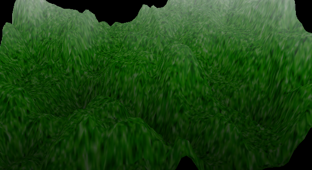

# Terrain

p=. 

## Description

This is a basic random terrain generator, created for a third year 3D Graphics Programming module. It uses a fault formation technique to generate the inital heightmap, and then an erorsion filter to simulate natural terrain erosion. It uses a framework that was provided by the university.

## Source Code

[github](https://github.com/moly/Terrain)

## Technical Details

**Language:** C++
**Tools:** Visual Studio, Photoshop
**Libraries:** OpenGL